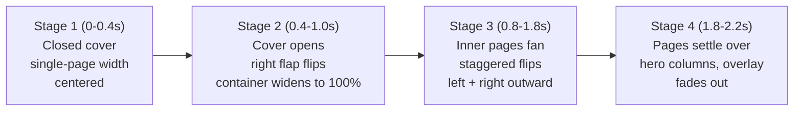

## Goal

The hero currently lives inside a single bordered container with a 3/5 + 2/5 column split, and `HeroNotebookOpening` flips a few overlay leaves on mount. We want:

1. The hero's **final/resting state** to already be a two-page book spread: two independently-bordered `50/50` "pages" sitting side-by-side, forming the open notebook.
2. A **one-time mount animation** that starts as a closed centered book (image 1) and ends exactly matching that final spread (image 2 → final).
3. The animation's last frame must line up pixel-perfectly with the real hero, so when the overlay fades out there's no visual jump.

## Animation stages (auto-play on mount, ~2.2s total)




Key idea: the underlying DOM is always the **final** two-page hero. The overlay sits on top (`absolute inset-0`) and animates from "closed book covering only the center" to "two pages matching the hero bounds", then fades out. There is no content inside the animated overlay — it's purely decorative shapes.

## Files to change

### 1. Split hero into two bordered pages — [apps/web/src/routes/_view/index.tsx](apps/web/src/routes/_view/index.tsx)

Replace the single container at line 247 with a parent holding two independently-bordered 50/50 pages. Left page holds text/CTA, right page holds YC badge + video. The parent provides the overlay's bounding box (so `HeroNotebookOpening` still just uses `absolute inset-0`).

Sketch:

```tsx
<section id="hero" className="isolate flex w-full overflow-visible pt-10">
  {/* This wrapper is the hero's bounding box; the animation overlays it */}
  <div className="relative flex min-h-[80vh] w-full flex-col md:flex-row">
    <HeroNotebookOpening />

    {/* LEFT PAGE */}
    <div className="border-color-bright relative flex w-full flex-col justify-between rounded-lg border px-4 pt-8 pb-8 md:w-1/2 md:rounded-r-none md:border-r-0 md:px-12 md:pt-12 md:pb-12">
      {/* AnnouncementBanner, h1, subtitle, CTA form/buttons — existing */}
    </div>

    {/* RIGHT PAGE */}
    <div className="border-color-bright relative hidden w-full shrink-0 self-stretch overflow-hidden rounded-lg border p-8 md:block md:w-1/2 md:rounded-l-none">
      {/* NotebookGrid, YC badge, MuxPlayer — existing */}
    </div>
  </div>
</section>
```

Important details:

- Desktop: each page has its own border. Outer corners stay rounded; spine-side corners are squared (`rounded-r-none` / `rounded-l-none`) and the inner border is dropped on the left page (`border-r-0`) so the two borders visually form the spine as a single hairline.
- Mobile: both pages get a full rounded border and stack vertically; no spine.
- Content rebalance for 50/50: the right page's inner video card (currently `w-4/5`) probably becomes `w-full` since the column is now narrower. The `NotebookGrid` + YC badge + video layout stays the same.

### 2. Rewrite overlay — [apps/web/src/components/hero-notebook-opening.tsx](apps/web/src/components/hero-notebook-opening.tsx)

Replace the current flat "flipping leaves" overlay with a staged animation. Structure:

- **Root**: `motion.div absolute inset-0 z-20 overflow-visible` with `perspective: 2000px`. Hidden on mobile (`hidden md:block`) and for `prefers-reduced-motion`. `AnimatePresence` fades it out at the end.
- **Closed-book group** (animates scale/position, not leaves):
  - A single `motion.div` centered, styled as a cover (dark navy fill, rounded corners, subtle page-stack shadow on the right edge).
  - Starts at `width: 50%` centered (`left: 25%`), `scale: 0.92`, slight tilt.
  - Animates to `width: 100%`, `left: 0`, `scale: 1`, `tilt: 0` while simultaneously the cover *disappears* (its front face rotates away) to reveal the leaves beneath.
- **Cover flaps** (two halves, one per side): same left/right halves as today, but:
  - Left cover flap: `origin-right`, rotates `0 → -180°` around the spine (reveals the left page).
  - Right cover flap: `origin-left`, rotates `0 → 180°` (reveals the right page).
  - Both are navy like the closed book, so they look like the cover splitting open.
  - Each flap grows its width from `25%` (closed-book half) to `50%` (final page half) during the flip so the outer edge lands on the hero's outer edge.
- **Inner leaves** (3–4 pairs): same mechanism as the existing `Leaf` component, but:
  - Start flipping after the cover is past 90° (staggered delay).
  - Each leaf is paper-colored (`surface bg-lined-notebook`) with a small inset shadow near the spine for depth.
  - `backfaceVisibility: hidden` so they disappear once past 90°.
  - The bottom-most leaf is styled to match the underlying hero's page borders so the final frame is invisible against the real hero.
- **Timing constants** at top of file:
  - `CLOSED_HOLD = 0.35s` (stage 1)
  - `COVER_OPEN_DURATION = 0.7s` (stage 2)
  - `LEAF_COUNT = 3`, `LEAF_DURATION = 0.65s`, `LEAF_STAGGER = 0.12s` (stage 3)
  - `FADE_OUT = 0.25s` (stage 4, fires after last leaf crosses 90°)
  - Total: `CLOSED_HOLD + COVER_OPEN_DURATION + (LEAF_COUNT-1)*LEAF_STAGGER + LEAF_DURATION + FADE_OUT` ≈ 2.2s
- **Reduced motion**: skip all stages, render nothing (hero shows instantly).

### 3. Design-token usage

Per [apps/web/AGENTS.md](apps/web/AGENTS.md): no hardcoded hex values.

- Cover color: use a dark brand-adjacent token. Options: `bg-stone-800` (tailwind scale, matches existing CTA family) or add a `--color-cover` token. Recommend `bg-stone-900` for the cover to match the dark navy look in image 1 without introducing a new token.
- Page color: keep existing `surface bg-lined-notebook`.
- Borders: keep `border-color-bright` so the spine matches the existing accent border.

## What stays the same

- `HeroSection` props, analytics, form logic, platform CTA variants — untouched.
- `NotebookGrid`, YC badge, `MuxPlayer`, `AnnouncementBanner` — unchanged, just reparented into the right page.
- Mobile layout — still stacks vertically; no animation.

## Risks / things to verify

- Video card sizing in the narrower right page (may need to drop `w-4/5` → `w-full` or add padding).
- The two-border spine trick (`border-r-0` on left page) needs to look like a single hairline, not a double border — might need a 1px negative margin on one side. Will verify visually.
- The closed-book scale must not clip content outside the hero's `overflow-visible` section; `z-20` overlay handles this.
- Exit timing: fade-out must start only after the last leaf is past 90° so we don't see a "snap" to the real hero.

