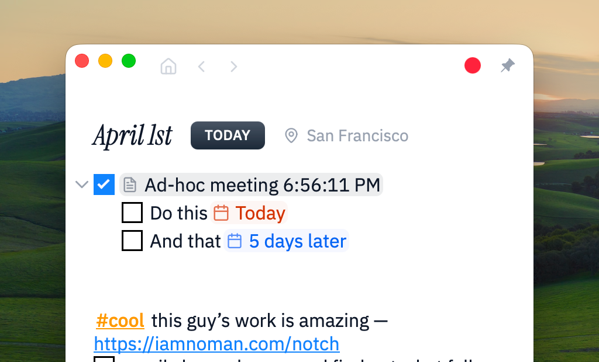
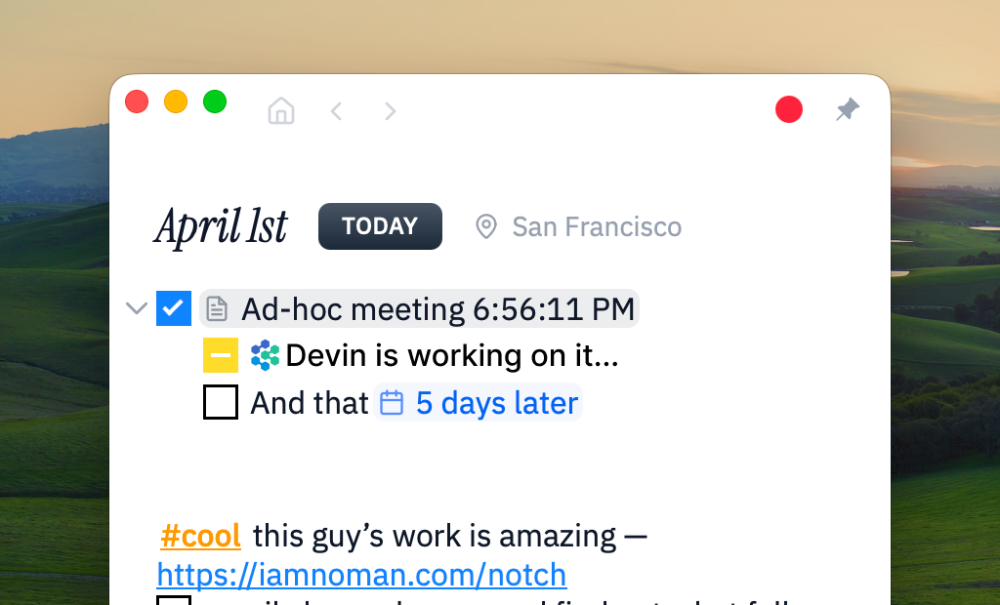
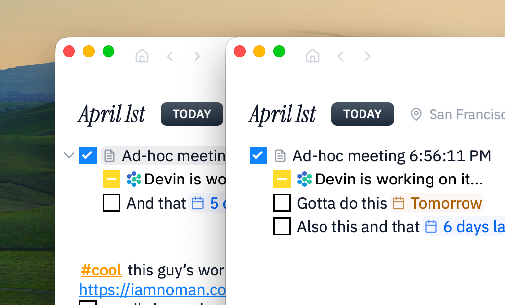

<!-- TODO: replace with Char 1.1 hero image -->


<p align="center">
  <p align="center">Char — AI <strong>daily notes</strong> that remember and act</p>
  <p align="center">
   <a href="https://deepwiki.com/fastrepl/char"></a>
   <a href="https://char.com/discord" target="_blank"></a>
   <a href="https://x.com/getcharnotes" target="_blank"></a>
  </p>
</p>

## What is Char?

Char is a daily notes app with an AI agent reading over your shoulder. Dump everything in — links, todos, chores, meeting notes, half-formed thoughts — and Char figures out what matters, keeps it moving, and gets things done.

One note per day. Context that compounds.

> *Week one it helps. Month one it knows you.*

## Installation

```bash
brew install --cask fastrepl/fastrepl/char
```

- [macOS](https://char.com/download) (public beta)
- [Windows](https://github.com/fastrepl/char/issues/66) (q2 2026)
- [Linux](https://github.com/fastrepl/char/issues/67) (q2 2026)

## Three things Char does

### 1. Daily notes as memory

The interface is a canvas. Dump whatever you want in — links you found interesting, something you need to buy, work you need to do, reminders, chores. Looks like a notepad. Under the hood, an AI agent is reading everything you write and understanding more about you as you go.

The subtle part: write down something that needs to be done, and Char keeps it alive. When the next day rolls around, unfinished items roll over automatically. Completed ones drop off. You never copy-paste yesterday's list again.



### 2. Context capture

Char captures the context around your day so you don't have to type it in.

- **Meetings** — listens directly to sounds coming in and out of your computer. No bots joining your calls. Transcripts, summaries, and action items flow into your daily note. Pick a template — bullet points, agenda-based, paragraph summary — or build your own. [Template gallery](https://char.com/templates).
- **Computer activity** — uses the macOS accessibility API to track what you're working on across apps. What you've already done gets picked up automatically, so the agent doesn't make you do it twice.
- **Calendars, contacts, and more** — already integrated with Apple Calendar, Google Calendar, Outlook Calendar, and Contacts. Coming soon: todos, knowledge bases (Notion, Obsidian), CRMs, and messengers.

> **Just want a local-first, on-device AI meeting notetaker?** Check out [Unsigned Char](https://github.com/fastrepl/unsigned-char) — a free standalone notetaker with speaker identification. No daily notes, no task delegation. Just transcription and summaries, fully local.


### 3. Proactive delegation

Traditionally, if you write something down in a todo list or daily note, the person who has to do it is you. You define the requirements, paste them into Claude Code or Cursor, hand it over, babysit.

With Char, every action item — including the ones nested under your meeting notes — has a button. Click it. It's deployed. The agent already has the context because it's been reading your daily note all along.



## Bring your own AI

Char works with whatever ASR and LLM you want. Run local models via Ollama or LM Studio, or plug in hosted providers (Gemini, Claude, Azure-hosted GPT, and more) for both transcription and reasoning. We democratize the choice — any model you want to use, Char will run on top of.

> **Note on accounts:** During onboarding, Char creates an account so you can experience the full product — including cloud-powered transcription and summarization — at its best quality. All your notes, transcripts, and data are stored locally on your machine in a local SQLite database. If you prefer not to keep an account, you can request deletion anytime at [char.com/app/account](https://char.com/app/account). Char will continue to work fully offline with a local LLM.


## AI chat

Ask follow-ups right inside your notes — "what were the action items?", "rewrite this in simpler language", "translate to Spanish".

<!-- TODO: replace with better AI chat visual -->


## Where this is going

When everyone on a team has their own daily note, those notes become a shared operating layer. Context flows between people automatically. Decisions leave a trail. Nothing falls through the cracks because the system remembers even when people don't.



Read the full thinking: [The future of Char](https://johnjeong.com/essays/future-of-char) by John Jeong.
