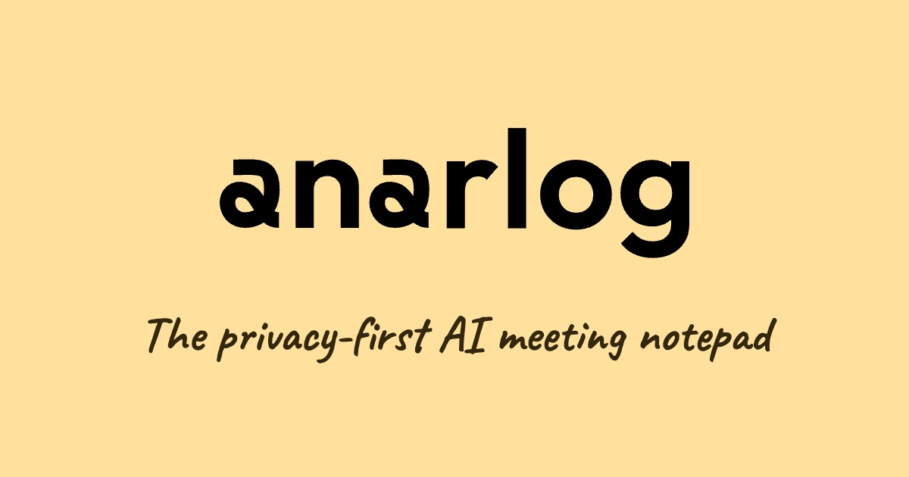

> **Note:** The team is now building **[char](https://char.com)**. The **anarlog** community application remains open-source, MIT-licensed, and maintained as the local-first meeting notetaker in this repo. Source-visible enterprise components are commercially licensed.

  

  <h1>anarlog</h1>

  

    <b>The privacy-first AI meeting notepad.</b>
     
    Open source, local-first, and yours to fork. Granola, rearranged.
  

  

    <a href="https://anarlog.so">Website</a>
    &nbsp;•&nbsp;
    <a href="https://docs.anarlog.so">Docs</a>
    &nbsp;•&nbsp;
    <a href="https://github.com/fastrepl/anarlog/releases/latest">Download</a>
    &nbsp;•&nbsp;
    <a href="https://discord.gg/Vk882WS3gF">Discord</a>
    &nbsp;•&nbsp;
    <a href="https://www.reddit.com/r/anarlog/">r/anarlog</a>
    &nbsp;•&nbsp;
    <a href="https://x.com/anarlogapp">@anarlogapp</a>
    &nbsp;•&nbsp;
    <a href="https://status.anarlog.so">Status</a>
  

  

    
    
    
    
  

  

 

anarlog is an open-source alternative to Granola. It takes notes in your meetings without sending a bot to join the call: it listens to your device audio, transcribes on your machine, and keeps everything in a local SQLite database you can open yourself.

It is built for people who want AI meeting notes without handing their conversations to someone else's cloud, and for anyone who needs to get a notetaker past a security review with a straight face.

## Why anarlog

- **No bot joins your call.** anarlog captures audio directly on your device. Nothing appears in the participant list, and nothing records from inside the meeting.
- **Local by default.** Transcription runs on-device, so meeting audio never has to leave your machine.
- **Your data, in a format you can read.** Sessions, notes, and transcripts live in local SQLite. Recordings and attachments are plain local files. Export Markdown whenever it fits your workflow.
- **Bring your own AI.** Use OpenAI, Anthropic, Gemini, OpenRouter, Ollama, LM Studio, Unsloth, or anything OpenAI-compatible, including fully local models.
- **Readable source, MIT.** The community application is MIT-licensed. Fork it, audit it, sell it, or self-host it.
- **Cloud is opt-in, not required.** Hosted AI, encrypted CloudSync, and sharing exist when you want them. Nothing depends on them.
- **A front door for your org.** Self-hosting and source-visible enterprise components give security and IT teams a real path to yes.

## What runs where

| Part of the workflow | Where it happens |
| --- | --- |
| Audio capture and recording | Your device |
| Transcription | Your device, on-device models |
| Notes and transcript storage | Local SQLite plus local files |
| AI summaries and chat | Your choice: local model, your own API key, or optional hosted AI |
| Sync and sharing | Off by default, opt-in encrypted CloudSync |

## Get started

1. Download the latest release for macOS (Apple Silicon or Intel), Windows, or Linux from [releases](https://github.com/fastrepl/anarlog/releases/latest).
2. Open it and join a meeting. anarlog records and transcribes locally as you go.
3. Generate a note, edit it like a document, and export Markdown when you need it.
4. Optional: connect an LLM provider or a local model in settings for summaries and chat.

Product docs live at [docs.anarlog.so](https://docs.anarlog.so). To self-host, clone the repo, build it, and run it.

## Repository map

| Path | What lives there |
| --- | --- |
| `apps/desktop` | Tauri v2 desktop app: React and TypeScript UI, Rust backend |
| `apps/web` | anarlog.so web app |
| `apps/api` | API server |
| `apps/cli` | CLI |
| `apps/mobile` | Mobile app |
| `plugins/*` | ~50 Tauri plugins: local STT, local LLM, calendar, export, notifications, and more |
| `crates/*` | ~180 Rust crates: audio capture, transcription, diarization, storage, and more |
| `packages/*` | Shared TypeScript packages: editor, database, UI, plugin SDK |
| `enterprise/` | Source-visible enterprise components, commercially licensed |

## Local development

Ask [DeepWiki](https://deepwiki.com/fastrepl/anarlog) — it stays current with the codebase and can answer setup, architecture, and where-does-X-live questions directly.

## Name history

**anarlog** started as **Hyprnote**, then briefly used the **char** name.

We later split the work into two projects. **[char](https://char.com)** is the team's current productivity app. **anarlog** is this open-source, local-first meeting notetaker.

This repository is not the current char codebase, and anarlog is not being retired. Its community application stays MIT-licensed, forkable, self-hostable, and built for local notes you control.

If you came here from Granola, welcome. If you came here from Hyprnote, welcome back.

Either way, it's yours.

## Contributing

Issues, pull requests, bug reports, and docs fixes are all welcome.

- Read [CONTRIBUTING.md](CONTRIBUTING.md) before opening a pull request.
- Join the community on [Discord](https://discord.gg/Vk882WS3gF) or [r/anarlog](https://www.reddit.com/r/anarlog/).

Contributions outside `enterprise/` are distributed under the MIT license.

## License

- Community application: [MIT](LICENSE)
- Enterprise components: [commercial](LICENSE.enterprise)
- Full boundary: [LICENSING.md](LICENSING.md)

Maintained by [fastrepl](https://github.com/fastrepl).

## Contributors

